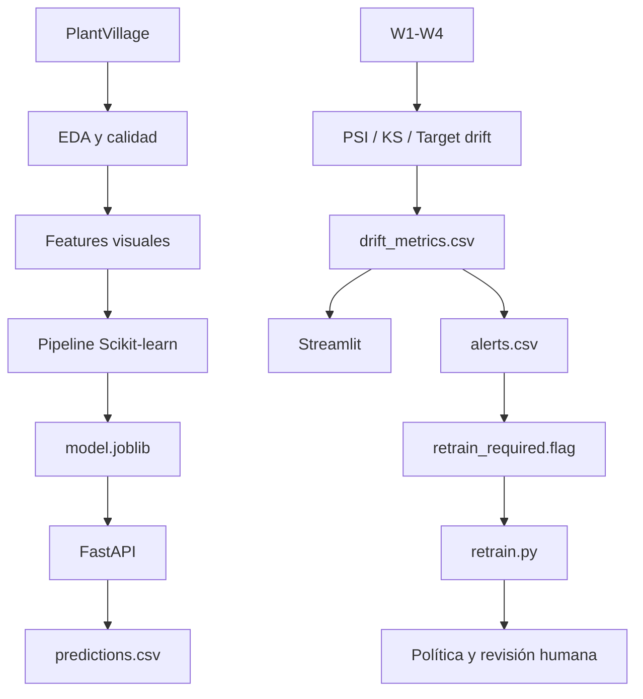

# MLOps local para clasificación de enfermedades foliares con monitoreo de Data Drift


### Autores

- Guido Ríos Ciaffaroni — guidoriosciaffaroni@gmail.com
- Eduardo Opazo DiaZ — edoopazod@gmail.com
.

### Curso

- Programa: Magíster en Ciencia de Datos.
- Asignatura: Tópicos en Data Science II.
- Evaluación: Proyecto final MLOps local con monitoreo de Data Drift.

### https://github.com/GuidoRiosCiaffaroni/TOPICOS_DE_DATA_SCIENCE_II


Prototipo reproducible de MLOps local para clasificar enfermedades foliares del tomate a partir de descriptores visuales extraídos de imágenes de PlantVillage. El sistema entrena y empaqueta un modelo de Machine Learning, expone inferencias mediante FastAPI, registra predicciones, simula ventanas de producción con drift creciente, calcula métricas de monitoreo, presenta un dashboard Streamlit y genera un gatillo semiautomático de evaluación de reentrenamiento.

> Proyecto final de **Tópicos en Data Science II — Magíster en Ciencia de Datos**.

## Tabla de contenidos

- [1. Resumen ejecutivo](#1-resumen-ejecutivo)
- [2. Problema de negocio](#2-problema-de-negocio)
- [3. Objetivo y alcance](#3-objetivo-y-alcance)
- [4. Arquitectura](#4-arquitectura)
- [5. Datos y variable objetivo](#5-datos-y-variable-objetivo)
- [6. Metodología](#6-metodología)
- [7. Resultados principales](#7-resultados-principales)
- [8. Estructura del repositorio](#8-estructura-del-repositorio)
- [9. Requisitos](#9-requisitos)
- [10. Instalación rápida](#10-instalación-rápida)
- [11. Ejecución completa](#11-ejecución-completa)
- [12. API de inferencia](#12-api-de-inferencia)
- [13. Simulación y monitoreo de drift](#13-simulación-y-monitoreo-de-drift)
- [14. Dashboard](#14-dashboard)
- [15. Alertas, reentrenamiento y política](#15-alertas-reentrenamiento-y-política)
- [16. Pruebas](#16-pruebas)
- [17. Reproducibilidad y ejecución menor a 10 minutos](#17-reproducibilidad-y-ejecución-menor-a-10-minutos)
- [18. Limitaciones](#18-limitaciones)
- [19. Trabajo futuro](#19-trabajo-futuro)
- [20. Solución de problemas](#20-solución-de-problemas)
- [21. Autores y licencia](#21-autores-y-licencia)

## 1. Resumen ejecutivo

Los modelos desplegados pueden deteriorarse aunque el código continúe funcionando. Esto ocurre cuando los datos de producción dejan de parecerse a los utilizados durante el entrenamiento o cuando cambia la relación entre las variables predictoras y el objetivo.

Este proyecto implementa el ciclo:

```text
Problema -> Datos -> Modelo -> Servicio -> Monitoreo -> Acción
```

El prototipo permite:

- procesar y auditar imágenes de hojas de tomate;
- extraer descriptores visuales reproducibles;
- entrenar un pipeline sin fuga de datos;
- comparar un baseline, Regresión Logística y Random Forest;
- guardar el modelo campeón con Joblib;
- servir predicciones con FastAPI y Uvicorn;
- registrar inputs, predicción, confianza y timestamp;
- simular ventanas `W1` a `W4` con drift creciente;
- calcular PSI, Kolmogorov-Smirnov y drift del target;
- evaluar F1 macro por ventana;
- visualizar métricas y alertas en Streamlit;
- generar `retrain_required.flag` ante drift significativo;
- recomendar monitoreo, revisión, reentrenamiento o rollback.

El sistema es deliberadamente liviano. No requiere Docker, Kubernetes, servicios cloud ni herramientas de pago.

## 2. Problema de negocio

El diagnóstico oportuno de enfermedades foliares ayuda a priorizar inspecciones y apoyar decisiones de manejo sanitario. Un clasificador entrenado con imágenes capturadas bajo condiciones controladas puede perder confiabilidad cuando recibe imágenes con cambios de iluminación, cámara, enfoque, contraste, fondo o composición de clases.

La predicción puede ser utilizada como apoyo preliminar por profesionales agrícolas, equipos técnicos o sistemas de inspección. No sustituye un diagnóstico agronómico especializado.

### Formulación de Machine Learning

El problema corresponde a clasificación multiclase:

```text
f(X) -> y_pred
```

donde:

- `X` contiene 15 descriptores visuales derivados de la imagen;
- `y` corresponde a la clase de condición foliar;
- `y_pred` es la clase estimada por el modelo.

### Relevancia del drift

Se monitorean dos fenómenos diferentes:

- **Data drift:** cambia la distribución de las entradas, es decir, `P_ref(X) != P_prod(X)`.
- **Concept drift:** cambia la relación entre entradas y objetivo, es decir, `P_ref(Y|X) != P_prod(Y|X)`.

La detección de data drift no demuestra automáticamente una caída de performance. Por eso el sistema analiza conjuntamente las distribuciones de entrada, el target disponible y F1 macro por ventana.

## 3. Objetivo y alcance

### Objetivo general

Construir un prototipo MLOps local, liviano y demostrable que permita entrenar un modelo, servir inferencias, registrar predicciones, simular producción, detectar drift, visualizar alertas y activar un plan de respuesta.

### Alcance incluido

- EDA y auditoría de calidad.
- Control de duplicados e imágenes no válidas.
- Auditoría de fuga de datos.
- Pipeline reproducible de Scikit-learn.
- Selección y empaquetado del modelo campeón.
- API local con FastAPI.
- Logging en CSV.
- Producción simulada en ventanas.
- PSI y test KS para variables numéricas.
- Chi-cuadrado y V de Cramér para el target categórico.
- Corrección FDR cuando corresponde.
- Dashboard Streamlit.
- Alertas persistentes.
- Gatillo semiautomático de reentrenamiento.
- Política de actuación auditable.

### Fuera de alcance

- Infraestructura cloud productiva.
- Kubernetes o Docker Compose.
- Reentrenamiento y promoción completamente automáticos.
- Diagnóstico agronómico definitivo.
- Validación externa con imágenes reales de terreno.

## 4. Arquitectura



La cadena de ejecución objetivo es:

```text
Dataset
  -> EDA
  -> Pipeline
  -> model.joblib
  -> FastAPI
  -> W1/W2/W3/W4
  -> Drift
  -> Streamlit
  -> Alerta
  -> Trigger de reentrenamiento
```

## 5. Datos y variable objetivo

### Dataset

El proyecto utiliza un subconjunto de imágenes de tomate de PlantVillage. Después del filtrado, consolidación, control de integridad y tratamiento de duplicados, el DataFrame analítico contiene:

- 18.146 observaciones;
- 10 clases;
- 15 características visuales predictoras;
- una variable objetivo denominada `clase`.

### Características predictoras

| Grupo | Variables |
|---|---|
| Color RGB | `r_mean`, `g_mean`, `b_mean`, `r_std`, `g_std`, `b_std` |
| Color HSV | `h_mean`, `s_mean`, `v_mean` |
| Vegetación e iluminación | `excess_green`, `brightness_mean` |
| Textura y calidad | `contrast_std`, `laplacian_variance`, `entropy`, `edge_density` |

### Variables excluidas

- `clase`: es el target y no puede ingresar a `X`.
- `ruta`: puede revelar información de la clase.
- `archivo`: identificador de alta cardinalidad.
- metadatos sin variabilidad discriminativa: se conservan solo para control de calidad.

### Desbalance

La razón aproximada entre la clase mayoritaria y la minoritaria es 14,36. Por ello se utilizan particiones estratificadas, métricas macro y análisis por clase.

## 6. Metodología

### 6.1 Preparación y calidad

1. Descarga reproducible del dataset.
2. Selección de clases de tomate.
3. Consolidación de directorios.
4. Verificación de imágenes corruptas.
5. Separación de duplicados.
6. Extracción de descriptores visuales.
7. Análisis univariado, bivariado y multivariado.
8. Auditoría de fuga de datos.

### 6.2 Partición

El dataset no contiene tiempo real de captura. Se usa una partición aleatoria estratificada con `RANDOM_STATE = 42`:

| Conjunto | Proporción | Observaciones |
|---|---:|---:|
| Train | 70 % | 12.702 |
| Validation | 15 % | 2.722 |
| Test | 15 % | 2.722 |

El preprocesamiento se ajusta exclusivamente con Train. Test permanece aislado hasta bloquear el modelo campeón.

### 6.3 Pipeline

```text
Features
  -> Feature engineering reproducible
  -> Imputación
  -> Estandarización cuando corresponde
  -> Clasificador
```

El pipeline completo se serializa para asegurar que entrenamiento e inferencia utilicen exactamente las mismas transformaciones.

### 6.4 Modelos

- `DummyClassifier`: baseline trivial.
- Regresión Logística: alternativa interpretable.
- Random Forest: alternativa flexible y no lineal.

### 6.5 Métrica principal

Se utiliza **F1 macro** porque asigna el mismo peso a cada clase, incluso cuando las frecuencias están desbalanceadas. También se calculan accuracy, precision, recall, balanced accuracy, ROC-AUC multiclase y matriz de confusión.

## 7. Resultados principales

| Modelo | CV F1 macro | Validation F1 macro | Resultado |
|---|---:|---:|---|
| DummyClassifier | — | 0,0456 | Baseline |
| Regresión Logística | 0,7095 ± 0,0018 | 0,7066 | Finalista interpretable |
| Random Forest | 0,8050 ± 0,0023 | 0,8092 | Campeón |

Después de bloquear el campeón, Random Forest obtiene:

- F1 macro Test: `0,8274`;
- diferencia absoluta Validation-Test: `0,0182`.

Estos resultados sugieren una generalización razonablemente estable dentro del dataset utilizado.

### Resultado bajo drift

Las perturbaciones crecientes producen una degradación progresiva. En W4 se observa aproximadamente:

```text
F1 macro original/test: 0,8274
F1 macro W4:            0,2779
```

Las perturbaciones modifican las entradas manteniendo las etiquetas originales. Por ello pueden simular data drift y, simultáneamente, alterar experimentalmente la relación entre `X` e `Y`. La caída no debe atribuirse exclusivamente a data drift.

## 8. Estructura del repositorio

```text
proyecto_mlops_drift/
|
|-- README.md
|-- requirements.txt
|-- 24_Topicos.ipynb
|
|-- data/
|   |-- raw/
|   |-- processed/
|   |-- reference/
|   `-- production/
|       `-- windows/
|           |-- W0.csv
|           |-- W1.csv
|           |-- W2.csv
|           |-- W3.csv
|           |-- W4.csv
|           `-- metadata.json
|
|-- models/
|   |-- model.joblib
|   `-- train_metrics.json
|
|-- src/
|   |-- transformers.py
|   |-- train.py
|   |-- drift.py
|   |-- simulate_production.py
|   |-- retrain_trigger.py
|   |-- retrain.py
|   `-- action_policy.py
|
|-- api/
|   |-- __init__.py
|   |-- schemas.py
|   |-- model_loader.py
|   |-- prediction_logger.py
|   |-- app.py
|   |-- windows.py
|   `-- server.py
|
|-- monitoring/
|   |-- predictions.csv
|   |-- psi_metrics.csv
|   |-- psi_details.csv
|   |-- ks_metrics.csv
|   |-- drift_metrics.csv
|   |-- window_summary.csv
|   |-- performance_metrics.csv
|   |-- alerts.csv
|   |-- retrain_required.flag
|   |-- retraining_requests.csv
|   `-- action_decisions.csv
|
|-- dashboard/
|   |-- dashboard.py
|   `-- dashboard_colab.html
|
`-- tests/
    |-- test_model.py
    |-- test_api.py
    `-- test_drift.py
```

### Estructura de los directorios

### > content
# 📁 Estructura del proyecto MLOps

La estructura principal del proyecto se organiza de la siguiente manera:

```text
.
├── 📁 .config/
├── 📁 __pycache__/
├── 📁 api/
├── 📁 dashboard/
├── 📁 data/
├── 📁 mlruns/
├── 📁 models/
├── 📁 monitoring/
├── 📁 plantvillage/
├── 📁 sample_data/
├── 📁 src/
│
├── 📄 app.py
├── 📊 informe_integridad_plantvillage.csv
├── 📄 streamlit_dashboard.log
├── 📄 streamlit_dashboard.pid
├── 📄 uvicorn.log
├── 📄 uvicorn.pid
├── 📄 uvicorn_windows.log
└── 📄 uvicorn_windows.pid
```

---

## 📂 Descripción de directorios

| Directorio | Descripción |
|---|---|
| `.config/` | Contiene archivos de configuración generados por el entorno de ejecución. |
| `__pycache__/` | Contiene archivos compilados automáticamente por Python durante la ejecución de los módulos. |
| `api/` | Contiene los componentes relacionados con la API de inferencia del modelo. |
| `dashboard/` | Contiene los archivos utilizados para la construcción y ejecución del dashboard de monitoreo. |
| `data/` | Almacena datos procesados, archivos intermedios y recursos utilizados durante las diferentes etapas del proyecto. |
| `mlruns/` | Contiene los registros de experimentos generados mediante MLflow. |
| `models/` | Almacena modelos entrenados, modelos serializados y otros artefactos asociados al proceso de Machine Learning. |
| `monitoring/` | Contiene los componentes relacionados con monitoreo del modelo, análisis de producción y detección de Data Drift. |
| `plantvillage/` | Contiene el conjunto de datos PlantVillage utilizado para el desarrollo del proyecto. |
| `sample_data/` | Contiene datos de ejemplo o archivos auxiliares disponibles en el entorno de ejecución. |
| `src/` | Contiene el código fuente principal del pipeline de Machine Learning y MLOps. |

---

## 📄 Descripción de archivos principales

| Archivo | Descripción |
|---|---|
| `app.py` | Aplicación principal utilizada para ejecutar o exponer el servicio del proyecto. |
| `informe_integridad_plantvillage.csv` | Informe generado durante el proceso de auditoría de integridad del dataset PlantVillage. |
| `streamlit_dashboard.log` | Archivo de registro correspondiente a la ejecución del dashboard desarrollado mediante Streamlit. |
| `streamlit_dashboard.pid` | Archivo que contiene el identificador del proceso asociado al dashboard de Streamlit. |
| `uvicorn.log` | Archivo de registro de ejecución del servidor Uvicorn. |
| `uvicorn.pid` | Archivo que contiene el identificador del proceso activo de Uvicorn. |
| `uvicorn_windows.log` | Registro asociado a la ejecución de Uvicorn utilizada para el procesamiento o servicio de las ventanas de producción. |
| `uvicorn_windows.pid` | Archivo que almacena el identificador del proceso correspondiente a la ejecución de Uvicorn para las ventanas de producción. |

---

# 🧠 Organización conceptual del proyecto

La estructura del repositorio representa las principales etapas del ciclo de vida de un sistema de Machine Learning bajo un enfoque MLOps.

El flujo general puede representarse de la siguiente manera:

```text
Datos
  │
  ▼
Preparación y validación
  │
  ▼
EDA y calidad de datos
  │
  ▼
Ingeniería de características
  │
  ▼
Modelado
  │
  ▼
Evaluación
  │
  ▼
Serialización
  │
  ▼
API de inferencia
  │
  ▼
Registro de predicciones
  │
  ▼
Monitoreo
  │
  ▼
Detección de Data Drift
  │
  ▼
Alertas
  │
  ▼
Revisión
  │
  ▼
Acción
```

---

# 🔄 Flujo MLOps del proyecto

El proyecto busca implementar un flujo reproducible para el desarrollo, despliegue y monitoreo de un modelo de Machine Learning.

De forma simplificada:

```text
PlantVillage
     │
     ▼
Preparación de datos
     │
     ▼
Control de calidad
     │
     ▼
Extracción de características
     │
     ▼
Entrenamiento de modelos
     │
     ▼
Selección del modelo campeón
     │
     ▼
Serialización del modelo
     │
     ▼
FastAPI
     │
     ▼
Inferencia
     │
     ▼
Registro de predicciones
     │
     ▼
Ventanas de producción
     │
     ▼
Monitoreo de Data Drift
     │
     ▼
Alertas
     │
     ▼
Evaluación de reentrenamiento
```

---

# 📊 Datos

El directorio:

```text
data/
```

se utiliza para almacenar información relacionada con las diferentes etapas del pipeline.

Puede contener:

- conjuntos de entrenamiento;
- conjuntos de validación;
- conjuntos de prueba;
- datos procesados;
- ventanas de producción;
- resultados de inferencia;
- archivos utilizados para monitoreo;
- métricas de desempeño;
- resultados de Data Drift.

---

# 🌿 Dataset PlantVillage

El directorio:

```text
plantvillage/
```

contiene las imágenes utilizadas para desarrollar el sistema de clasificación.

El proyecto utiliza exclusivamente imágenes correspondientes a hojas de tomate.

Después de las etapas de:

- filtrado;
- consolidación;
- verificación de integridad;
- detección de duplicados;
- separación de copias redundantes;

el dataset principal queda compuesto por:

```text
18.146 imágenes únicas
```

distribuidas en:

```text
10 clases sanitarias
```

---

# 🧪 Experimentos con MLflow

El directorio:

```text
mlruns/
```

es utilizado por MLflow para almacenar información relacionada con los experimentos.

Puede incluir:

- parámetros;
- hiperparámetros;
- métricas;
- modelos;
- artefactos;
- resultados de diferentes ejecuciones.

Esto permite mantener trazabilidad entre diferentes experimentos realizados durante el desarrollo.

---

# 🤖 Modelos

El directorio:

```text
models/
```

contiene los modelos entrenados y serializados.

La organización de los modelos permite separar los artefactos de Machine Learning del código fuente.

Los modelos almacenados pueden ser posteriormente cargados por la API de inferencia sin necesidad de volver a ejecutar el entrenamiento.

---

# ⚙️ Código fuente

El directorio:

```text
src/
```

contiene el código principal del proyecto.

Este directorio puede incluir componentes relacionados con:

- carga de datos;
- preprocesamiento;
- extracción de características;
- entrenamiento;
- evaluación;
- serialización;
- inferencia;
- monitoreo;
- detección de Data Drift;
- generación de alertas;
- procedimientos de reentrenamiento.

---

# 🌐 API de inferencia

El directorio:

```text
api/
```

contiene los componentes utilizados para exponer el modelo mediante una API.

El servicio puede implementarse mediante:

```text
FastAPI
```

y ejecutarse utilizando:

```text
Uvicorn
```

El flujo general de inferencia es:

```text
Cliente
   │
   ▼
FastAPI
   │
   ▼
Validación de entrada
   │
   ▼
Preprocesamiento
   │
   ▼
Modelo
   │
   ▼
Predicción
   │
   ▼
Respuesta JSON
```

---

# 📡 Monitoreo

El directorio:

```text
monitoring/
```

contiene los componentes relacionados con la observación del comportamiento del modelo durante producción.

El monitoreo puede considerar:

- distribución de variables;
- características visuales;
- distribución de predicciones;
- métricas de Data Drift;
- métricas de performance;
- alertas;
- estados de revisión;
- decisiones de reentrenamiento.

---

# 📉 Data Drift

El monitoreo de Data Drift permite detectar cambios entre los datos utilizados como referencia y los datos recibidos durante producción.

En el proyecto se utilizan ventanas simuladas de producción:

```text
W0 → Referencia

W1 → Producción estable

W2 → Drift leve

W3 → Drift moderado

W4 → Drift significativo
```

Estas ventanas permiten estudiar cómo cambia progresivamente la distribución de los datos y cómo estas modificaciones pueden afectar el comportamiento del modelo.

---

# 📊 Dashboard

El directorio:

```text
dashboard/
```

contiene los archivos utilizados para visualizar el estado del sistema.

El dashboard puede mostrar información como:

- métricas del modelo;
- evolución de ventanas;
- indicadores de Data Drift;
- distribución de variables;
- alertas;
- estado operacional;
- comportamiento de las predicciones.

El dashboard puede implementarse mediante:

```text
Streamlit
```

---

# 📝 Archivos de logs

Los archivos:

```text
streamlit_dashboard.log
uvicorn.log
uvicorn_windows.log
```

permiten registrar información generada durante la ejecución de los servicios.

Los logs pueden utilizarse para:

- detectar errores;
- analizar el comportamiento de la aplicación;
- revisar el inicio y cierre de servicios;
- identificar problemas en la API;
- mantener trazabilidad operacional.

---

# 🔢 Archivos PID

Los archivos:

```text
streamlit_dashboard.pid
uvicorn.pid
uvicorn_windows.pid
```

contienen los identificadores de los procesos que ejecutan determinados servicios.

Estos archivos permiten administrar procesos que se ejecutan en segundo plano.

---

# 📑 Informe de integridad

El archivo:

```text
informe_integridad_plantvillage.csv
```

contiene los resultados de la auditoría realizada sobre las imágenes del dataset.

La auditoría permite verificar:

- existencia del archivo;
- integridad;
- formato;
- resolución;
- número de canales;
- modo de color;
- posibles archivos problemáticos.

Este control constituye una etapa fundamental antes del entrenamiento del modelo.

---

# 🧩 Separación de responsabilidades

La estructura del proyecto busca mantener separados los principales componentes del sistema:

```text
data/
```

Datos utilizados por el sistema.

```text
src/
```

Lógica principal del pipeline.

```text
models/
```

Modelos entrenados y serializados.

```text
api/
```

Servicio de inferencia.

```text
monitoring/
```

Monitoreo y Data Drift.

```text
dashboard/
```

Visualización operacional.

```text
mlruns/
```

Seguimiento de experimentos.

Esta separación facilita:

- mantenimiento;
- reproducibilidad;
- escalabilidad;
- depuración;
- trazabilidad;
- trabajo colaborativo.

---

# 🧹 Archivos que normalmente no deberían almacenarse en GitHub

Algunos elementos mostrados en la estructura son generados automáticamente durante la ejecución.

Entre ellos:

```text
__pycache__/
*.log
*.pid
```

Normalmente estos archivos deberían excluirse utilizando un archivo:

```text
.gitignore
```

Por ejemplo:

```gitignore
# Archivos compilados de Python
__pycache__/
*.py[cod]

# Logs
*.log

# Archivos PID
*.pid

# Archivos temporales
*.tmp
*.temp

# Configuraciones locales
.env

# Jupyter
.ipynb_checkpoints/

# Sistema operativo
.DS_Store
Thumbs.db
```

---

# ✅ Estructura recomendada del repositorio

Una versión más limpia para GitHub podría quedar organizada de la siguiente forma:

```text
.
├── api/
├── dashboard/
├── data/
├── models/
├── monitoring/
├── plantvillage/
├── src/
├── app.py
├── informe_integridad_plantvillage.csv
├── README.md
├── requirements.txt
└── .gitignore
```

Los archivos generados durante la ejecución pueden mantenerse fuera del control de versiones:

```text
__pycache__/
*.log
*.pid
```

---

# 🎯 Objetivo de la organización

La organización del repositorio busca mantener un proyecto reproducible y estructurado que permita cubrir el ciclo completo de Machine Learning y MLOps:

```text
Datos
  ↓
Calidad
  ↓
EDA
  ↓
Modelado
  ↓
Evaluación
  ↓
Serialización
  ↓
Servicio de inferencia
  ↓
Producción
  ↓
Monitoreo
  ↓
Data Drift
  ↓
Alertas
  ↓
Revisión
  ↓
Reentrenamiento o Rollback
```

Esta estructura permite separar claramente el desarrollo experimental del funcionamiento operacional del sistema y facilita la incorporación progresiva de nuevas funcionalidades.

### > Documentos
# 📄 Documentación del proyecto

El repositorio incluye los siguientes documentos complementarios:

```text
.
├── 📊 Foliar_Disease_MLOps.pptx
└── 📄 ResumenEjecutivo.docx
```

---

## 📁 Descripción de archivos

| Archivo | Tipo | Descripción |
|---|---|---|
| `Foliar_Disease_MLOps.pptx` | Presentación PowerPoint | Presentación ejecutiva del proyecto MLOps orientado a la clasificación de enfermedades foliares del tomate. Resume la problemática, preparación de datos, modelado, evaluación, despliegue, monitoreo de Data Drift y principales resultados. |
| `ResumenEjecutivo.docx` | Documento Word | Informe ejecutivo del proyecto. Contiene la problemática y justificación de negocio, EDA, calidad de datos, descripción del sistema, monitoreo MLOps, Data Drift, interpretación de resultados y conclusiones. |

---

# 📊 Presentación del proyecto

El archivo:

```text
Foliar_Disease_MLOps.pptx
```

contiene la presentación utilizada para sintetizar visualmente las principales etapas del proyecto.

Entre los contenidos principales se encuentran:

- problemática y justificación de negocio;
- descripción del dataset PlantVillage;
- calidad y preparación de los datos;
- análisis exploratorio de datos;
- desarrollo del modelo de Machine Learning;
- evaluación del modelo;
- arquitectura MLOps;
- servicio de inferencia;
- monitoreo de producción;
- detección de Data Drift;
- alertas y política de actuación;
- resultados y conclusiones.

---

# 📄 Resumen ejecutivo

El archivo:

```text
ResumenEjecutivo.docx
```

presenta una síntesis técnica y ejecutiva del proyecto.

Su propósito es documentar de manera estructurada:

- el problema abordado;
- la relevancia operacional de la solución;
- las características y calidad del dataset;
- el proceso de modelado;
- los principales resultados obtenidos;
- la necesidad de monitorear Data Drift;
- el impacto potencial del deterioro del modelo;
- las acciones propuestas frente a alertas;
- las principales conclusiones del proyecto.

---

# 🧩 Relación entre ambos documentos

Ambos archivos cumplen funciones complementarias:

```text
ResumenEjecutivo.docx
        │
        │  Desarrollo técnico y ejecutivo
        ▼
Contenido detallado del proyecto
        │
        ▼
Foliar_Disease_MLOps.pptx
        │
        │  Síntesis visual
        ▼
Presentación de resultados
```

El documento Word contiene el desarrollo más detallado, mientras que la presentación PowerPoint resume los aspectos principales para su exposición y comunicación.
### > Img
Imagenes Para los Documentos

### > Modelos
# 🧪 Archivos principales del modelo MLOps

El repositorio incluye los siguientes archivos relacionados con el entrenamiento, validación, transformación y despliegue del modelo de Machine Learning aplicado al conjunto PlantVillage:

```text
.
├── 📓 Demo_Modelo_MLOps_PlantVillage.ipynb
├── 🤖 model.joblib
├── 🐍 prueba_modelo_plantvillage.py
├── 📊 train_metrics.json
└── 🐍 transformers.py
```

---

## 📁 Descripción de archivos

| Archivo | Tipo | Descripción |
|---|---|---|
| `Demo_Modelo_MLOps_PlantVillage.ipynb` | Jupyter Notebook | Notebook principal utilizado para demostrar y documentar el funcionamiento del modelo MLOps aplicado al dataset PlantVillage. |
| `model.joblib` | Modelo serializado | Archivo que contiene el modelo de Machine Learning entrenado y serializado para ser reutilizado sin necesidad de volver a entrenarlo. |
| `prueba_modelo_plantvillage.py` | Script Python | Script destinado a probar la carga, funcionamiento e inferencia del modelo entrenado sobre datos de PlantVillage. |
| `train_metrics.json` | Archivo JSON | Contiene métricas registradas durante el entrenamiento y evaluación del modelo. |
| `transformers.py` | Script Python | Contiene funciones o transformaciones utilizadas para preparar los datos antes de enviarlos al modelo. |

---

# 📓 Notebook principal

El archivo:

```text
Demo_Modelo_MLOps_PlantVillage.ipynb
```

corresponde al notebook principal de demostración del modelo.

Puede incluir etapas como:

- carga del entorno;
- preparación de datos;
- carga del modelo entrenado;
- ejecución de inferencias;
- evaluación de predicciones;
- visualización de resultados;
- verificación de métricas;
- pruebas del pipeline MLOps;
- integración con componentes de monitoreo.

Su objetivo es proporcionar una ejecución reproducible y documentada del flujo completo del modelo.

---

# 🤖 Modelo serializado

El archivo:

```text
model.joblib
```

contiene el modelo entrenado y almacenado mediante serialización.

Este mecanismo permite guardar el modelo después del entrenamiento y recuperarlo posteriormente para realizar inferencias.

El flujo general es:

```text
Entrenamiento
     │
     ▼
Modelo entrenado
     │
     ▼
Serialización
     │
     ▼
model.joblib
     │
     ▼
Carga del modelo
     │
     ▼
Inferencia
```

La principal ventaja es evitar la necesidad de volver a entrenar el modelo cada vez que se inicia el servicio.

---

# 🧪 Script de prueba del modelo

El archivo:

```text
prueba_modelo_plantvillage.py
```

permite verificar el funcionamiento del modelo fuera del notebook.

Este script puede utilizarse para:

- cargar `model.joblib`;
- cargar los transformadores necesarios;
- preparar observaciones de entrada;
- generar predicciones;
- verificar probabilidades;
- comprobar compatibilidad entre entrenamiento e inferencia;
- detectar errores antes de integrar el modelo con la API.

El flujo conceptual puede representarse como:

```text
Datos de prueba
      │
      ▼
Transformaciones
      │
      ▼
Modelo
      │
      ▼
Predicción
      │
      ▼
Validación del resultado
```

---

# 📊 Métricas de entrenamiento

El archivo:

```text
train_metrics.json
```

almacena información relacionada con el desempeño obtenido durante el entrenamiento y evaluación del modelo.

Este tipo de archivo puede contener valores como:

- accuracy;
- precision;
- recall;
- F1 macro;
- ROC-AUC;
- métricas de validación;
- métricas de test;
- parámetros del experimento.

Su utilización permite mantener trazabilidad entre el modelo almacenado y los resultados obtenidos durante su desarrollo.

Ejemplo conceptual:

```text
Modelo
  │
  ├── model.joblib
  │
  └── train_metrics.json
```

De esta manera, el artefacto del modelo puede mantenerse asociado a sus métricas de referencia.

---

# 🔄 Transformaciones

El archivo:

```text
transformers.py
```

contiene las funciones necesarias para transformar los datos antes de realizar una predicción.

Estas transformaciones deben mantenerse consistentes entre:

```text
Entrenamiento
```

e:

```text
Inferencia
```

El flujo esperado es:

```text
Entrada
  │
  ▼
transformers.py
  │
  ▼
Datos transformados
  │
  ▼
model.joblib
  │
  ▼
Predicción
```

Mantener las mismas transformaciones durante entrenamiento y producción es fundamental para evitar inconsistencias entre ambos entornos.

---

# 🔗 Relación entre los archivos

Los cinco archivos forman parte de un mismo flujo operacional:

```text
Demo_Modelo_MLOps_PlantVillage.ipynb
                │
                ▼
        Entrenamiento / Demo
                │
                ▼
        ┌───────────────┐
        │               │
        ▼               ▼
  model.joblib     train_metrics.json
        │
        ▼
  transformers.py
        │
        ▼
prueba_modelo_plantvillage.py
        │
        ▼
     Inferencia
        │
        ▼
Validación del funcionamiento
```

---

# 🧩 Organización funcional

La función de cada archivo puede resumirse de la siguiente manera:

```text
Demo_Modelo_MLOps_PlantVillage.ipynb
        │
        └── Desarrollo y demostración

model.joblib
        │
        └── Modelo entrenado

train_metrics.json
        │
        └── Métricas de referencia

transformers.py
        │
        └── Transformación de entrada

prueba_modelo_plantvillage.py
        │
        └── Pruebas e inferencia
```

---

# ⚙️ Flujo de inferencia

El funcionamiento del modelo puede representarse mediante:

```text
Nueva observación
       │
       ▼
transformers.py
       │
       ▼
Preprocesamiento
       │
       ▼
model.joblib
       │
       ▼
Predicción
       │
       ▼
Resultado
```

---

# ✅ Objetivo de esta estructura

La separación de estos archivos permite mantener claramente diferenciadas las etapas de:

- experimentación;
- entrenamiento;
- persistencia del modelo;
- transformación de datos;
- evaluación;
- pruebas;
- inferencia.

Esta organización facilita la reproducibilidad del proyecto y permite utilizar el modelo dentro de una arquitectura MLOps sin depender exclusivamente del notebook de desarrollo.


### > Trabajo


Algunos CSV, modelos y ventanas son artefactos generados. Si no se versionan en Git, deben reconstruirse ejecutando el notebook o los scripts correspondientes.

## 9. Requisitos

### Software

- Python 3.10 o superior.
- Git.
- `pip`.
- Navegador web para FastAPI y Streamlit.

### Librerías principales

- NumPy y Pandas: procesamiento de datos.
- Matplotlib y Seaborn: visualización.
- SciPy: tests estadísticos.
- Scikit-learn: pipeline y modelado.
- Joblib: serialización.
- FastAPI: servicio de inferencia.
- Uvicorn: servidor ASGI.
- Pydantic: validación del contrato.
- Streamlit: dashboard.

### Recursos

El pipeline tabular puede ejecutarse en CPU. No requiere GPU para inferencia, monitoreo ni dashboard. La extracción inicial de descriptores desde todas las imágenes puede tardar más que la demostración con artefactos ya generados.

## 10. Instalación rápida

### 10.1 Clonar el repositorio

```bash
git clone <URL_DEL_REPOSITORIO>
cd proyecto_mlops_drift
```

Reemplace `<URL_DEL_REPOSITORIO>` por la URL real del proyecto.

### 10.2 Crear un entorno virtual

Linux o macOS:

```bash
python3 -m venv .venv
source .venv/bin/activate
```

Windows PowerShell:

```powershell
py -m venv .venv
.venv\Scripts\Activate.ps1
```

### 10.3 Instalar dependencias

```bash
python -m pip install --upgrade pip
pip install -r requirements.txt
```

### 10.4 Verificación mínima

```bash
python -c "import sklearn, fastapi, streamlit; print('Entorno correcto')"
```

## 11. Ejecución completa

### Opción A — Demo rápida con artefactos incluidos

Esta es la opción recomendada para la defensa oral.

1. Instalar las dependencias.
2. Verificar que existan `models/model.joblib` y `models/train_metrics.json`.
3. Levantar la API.
4. ejecutar o cargar las ventanas de producción.
5. calcular/consultar las métricas de drift.
6. abrir el dashboard.
7. mostrar las alertas y el flag de reentrenamiento.

Terminal 1:

```bash
uvicorn api.app:app --host 127.0.0.1 --port 8000
```

Terminal 2:

```bash
streamlit run dashboard/dashboard.py --server.port 8501
```

Terminal 3:

```bash
python src/retrain.py --check
```

### Opción B — Reconstrucción analítica

Abra y ejecute secuencialmente:

```text
24_Topicos.ipynb
```

El notebook realiza descarga, preparación, EDA, entrenamiento, empaquetado, API, simulación, monitoreo y política de actuación. La descarga y extracción inicial del dataset no forman parte de la demo rápida inferior a 10 minutos.

### Ejecución en Google Colab

1. Subir o abrir el notebook.
2. Seleccionar `Entorno de ejecución -> Ejecutar todas`.
3. Autorizar la descarga del dataset cuando corresponda.
4. Verificar la creación de `models/`, `api/`, `src/`, `monitoring/` y `dashboard/`.
5. Utilizar `TestClient` para pruebas internas de FastAPI.
6. Utilizar el proxy o visualizador HTML proporcionado por el notebook para Streamlit.

En Colab, `127.0.0.1` pertenece a la máquina virtual remota. Abrir esa dirección directamente en el navegador local no expone el servicio. Para pruebas reproducibles se recomienda `TestClient`; para la interfaz se utiliza el mecanismo de visualización definido en el notebook.

## 12. API de inferencia

### Iniciar el servicio

```bash
uvicorn api.app:app --host 127.0.0.1 --port 8000
```

La documentación interactiva queda disponible en:

```text
http://127.0.0.1:8000/docs
```

### `GET /health`

Comprueba que el servicio y el modelo estén disponibles.

```bash
curl http://127.0.0.1:8000/health
```

Respuesta esperada de referencia:

```json
{
  "status": "ok"
}
```

### `POST /predict`

Recibe las 15 features numéricas y devuelve clase, confianza e identificador de inferencia.

Ejemplo genérico:

```bash
curl -X POST "http://127.0.0.1:8000/predict" \
  -H "Content-Type: application/json" \
  -d '{
    "r_mean": 0.45,
    "g_mean": 0.47,
    "b_mean": 0.40,
    "r_std": 0.16,
    "g_std": 0.14,
    "b_std": 0.18,
    "h_mean": 115.0,
    "s_mean": 0.25,
    "v_mean": 0.49,
    "excess_green": 0.08,
    "brightness_mean": 0.45,
    "contrast_std": 0.15,
    "laplacian_variance": 4000.0,
    "entropy": 7.0,
    "edge_density": 0.13
  }'
```

Cada predicción válida se registra en:

```text
monitoring/predictions.csv
```

El registro incluye timestamp, inputs, predicción, confianza e `inference_id`.

### Validación

La API rechaza con HTTP 422:

- requests incompletos;
- tipos incorrectos;
- campos adicionales no permitidos;
- valores incompatibles con el contrato.

## 13. Simulación y monitoreo de drift

### Ventanas

| Ventana | Interpretación | Perturbación esperada |
|---|---|---|
| W0 | Referencia | Sin perturbación |
| W1 | Producción estable | Variación muestral |
| W2 | Drift leve | Perturbación baja |
| W3 | Drift moderado | Perturbación intermedia |
| W4 | Drift significativo | Perturbación alta |

Las ventanas se guardan en:

```text
data/production/windows/
```

### PSI

Para cada feature numérica:

```text
PSI < 0.10         -> Normal
0.10 <= PSI < 0.20 -> Warning
PSI >= 0.20        -> Drift significativo
```

Los bins se construyen con la distribución de referencia W0. El self-check W0 contra W0 debe producir PSI igual a cero.

### Kolmogorov-Smirnov

Se registra:

- estadístico `D_KS`;
- p-value;
- p-value ajustado por FDR;
- magnitud operacional;
- severidad.

La significancia estadística se interpreta junto con el tamaño de efecto. Un p-value pequeño no implica por sí solo relevancia operacional.

### Target drift

Cuando el target está disponible se comparan las distribuciones mediante Chi-cuadrado y V de Cramér. Target drift no demuestra por sí solo concept drift.

### Performance por ventana

Se calcula F1 macro en W0-W4. El sistema verifica si el drift coincide con deterioro real; no asume una relación automática.

### Archivos de monitoreo

```text
monitoring/psi_metrics.csv
monitoring/psi_details.csv
monitoring/ks_metrics.csv
monitoring/drift_metrics.csv
monitoring/window_summary.csv
monitoring/performance_metrics.csv
```

## 14. Dashboard

### Ejecutar Streamlit

```bash
streamlit run dashboard/dashboard.py --server.port 8501
```

Abrir:

```text
http://127.0.0.1:8501
```

El dashboard presenta:

- estado general del sistema;
- F1 macro por ventana;
- evolución de PSI y KS;
- métricas por feature;
- variables que generan alertas;
- target drift;
- acciones recomendadas.

Para Colab también se genera una alternativa autocontenida:

```text
dashboard/dashboard_colab.html
```

## 15. Alertas, reentrenamiento y política

### Registro de alertas

Las métricas que superan los criterios operacionales se persisten en:

```text
monitoring/alerts.csv
```

Cada fila identifica:

- timestamp;
- ventana;
- feature;
- métrica;
- valor;
- umbral;
- severidad;
- performance;
- acción recomendada;
- clave idempotente.

### Gatillo de reentrenamiento

Ante `Drift significativo`, el sistema puede crear:

```text
monitoring/retrain_required.flag
```

El flag contiene JSON auditable con ventana, alertas activadoras, features afectadas, performance, prioridad y estado de revisión.

Validar el gatillo:

```bash
python src/retrain.py --check
```

Aprobar la solicitud para una etapa posterior:

```bash
python src/retrain.py --approve
```

`--approve` no entrena ni reemplaza automáticamente el modelo. Cambia la solicitud a `approved_for_retraining` y mantiene la revisión humana.

### Política de actuación

| Estado | Performance | Acción principal |
|---|---|---|
| Normal | Estable | Continuar monitoreando |
| Normal | Deteriorada | Investigar concept drift o target |
| Warning | Estable | Revisión manual y seguimiento reforzado |
| Warning | Deteriorada | Preparar evaluación de reentrenamiento |
| Significativo | Estable | Validar drift antes de intervenir |
| Significativo | Crítica | Evaluar reentrenamiento o rollback |

Las decisiones se registran en:

```text
monitoring/action_decisions.csv
```

### Seguridad del modelo

El sistema nunca sustituye `models/model.joblib` solo porque exista drift. Un candidato debe entrenarse con datos validados y compararse con el campeón. Si no supera los criterios de aceptación, el campeón se conserva.

## 16. Pruebas

### Pruebas incluidas en el notebook

- equivalencia del pipeline antes y después de serializar;
- carga de `model.joblib`;
- request válido;
- request incompleto;
- tipo incorrecto;
- campo adicional;
- registro exitoso en CSV;
- endpoints de ventanas;
- self-check PSI W0-W0;
- self-check KS W0-W0;
- smoke test de Streamlit;
- contrato de `alerts.csv`;
- idempotencia del flag;
- contrato de la política de actuación.

### Pytest

Si el repositorio contiene la carpeta `tests/`:

```bash
pytest -q
```

Pruebas recomendadas:

```text
tests/test_model.py
tests/test_api.py
tests/test_drift.py
```

### Smoke tests manuales

```bash
curl http://127.0.0.1:8000/health
curl http://127.0.0.1:8501/_stcore/health
python src/retrain.py --check
```

## 17. Reproducibilidad y ejecución menor a 10 minutos

El práctico exige que la ejecución local siguiendo este README pueda demostrarse en menos de 10 minutos. Para cumplirlo se distinguen dos procesos:

### Reconstrucción completa

Incluye descarga del dataset, lectura de miles de imágenes y extracción de features. Puede superar 10 minutos según red y hardware. Se utiliza para reproducir el análisis desde los datos originales.

### Demo operacional

Utiliza los artefactos ya generados:

- `models/model.joblib`;
- `models/train_metrics.json`;
- ventanas W0-W4;
- métricas de monitoreo;
- dashboard;
- alertas y flag.

La demo debe medir explícitamente:

```bash
time python src/retrain.py --check
```

Y registrar tiempos de:

1. instalación en entorno preparado;
2. carga del modelo;
3. inicio de FastAPI;
4. consulta de inferencia;
5. lectura/cálculo de drift;
6. inicio de Streamlit;
7. validación del gatillo.

### Semilla

Se utiliza:

```python
RANDOM_STATE = 42
```

La semilla controla particiones y operaciones aleatorias reproducibles. No garantiza igualdad binaria entre versiones distintas de todas las librerías o plataformas.

## 18. Limitaciones

- PlantVillage puede haber sido capturado en condiciones controladas.
- Las imágenes de terreno pueden tener fondos, escalas y dispositivos distintos.
- Existe desbalance entre clases.
- No hay timestamps reales de captura.
- El drift se simula mediante perturbaciones controladas.
- Las perturbaciones pueden alterar simultáneamente `P(X)` y la relación efectiva entre `X` e `Y`.
- La validación es interna y no incluye un dataset externo.
- Las features manuales no capturan toda la información espacial de una imagen.
- Random Forest no corresponde a un modelo de Deep Learning.
- Los umbrales PSI, KS y de caída de performance son criterios operacionales del prototipo.
- La aparición de drift no demuestra que reentrenar sea siempre la mejor respuesta.
- El sistema es un prototipo académico, no un dispositivo de diagnóstico.

## 19. Trabajo futuro

- Validación externa con imágenes de campo.
- Incorporación de timestamps reales.
- Extracción de features dentro de la API desde la imagen original.
- Monitoreo de calidad de imagen antes de inferir.
- Comparación con CNN o Transfer Learning.
- Explicabilidad visual mediante Grad-CAM para modelos convolucionales.
- Versionado formal de modelos y rollback probado.
- Entrenamiento de candidato en un script independiente.
- Registro en SQLite.
- Pruebas automatizadas en integración continua.
- Umbrales calibrados con costos reales y tasas aceptables de falsas alertas.
- Monitoreo de latencia, errores y volumen, además del drift estadístico.

## 20. Solución de problemas

### No se encuentra `model.joblib`

```text
FileNotFoundError: models/model.joblib
```

Ejecute la sección de empaquetado del notebook o incorpore el artefacto generado en `models/`.

### Error al importar `src.transformers`

El modelo serializado utiliza una transformación personalizada. Verifique que exista:

```text
src/transformers.py
```

y que el comando se ejecute desde la raíz del proyecto.

### Puerto 8000 ocupado

```bash
uvicorn api.app:app --host 127.0.0.1 --port 8001
```

Actualice las URLs de prueba para usar el mismo puerto.

### Puerto 8501 ocupado

```bash
streamlit run dashboard/dashboard.py --server.port 8502
```

### FastAPI funciona en Colab, pero no abre en el navegador

La dirección `127.0.0.1` pertenece a la VM de Colab. Utilice `TestClient` para pruebas internas o el método de proxy definido en el notebook.

### No existe `retrain_required.flag`

Esto puede ser correcto si la última ventana no tiene alertas de severidad significativa. Verifique primero:

```text
monitoring/alerts.csv
monitoring/window_summary.csv
```

### Streamlit inicia, pero no encuentra métricas

Ejecute previamente las secciones de PSI, KS, target drift, performance y consolidación. Verifique:

```text
monitoring/drift_metrics.csv
monitoring/window_summary.csv
```

### Git intenta subir el dataset completo

Los datasets de imágenes pueden ser demasiado grandes. Se recomienda ignorar datos descargables y conservar solo muestras o artefactos indispensables. Ejemplo para `.gitignore`:

```gitignore
.venv/
__pycache__/
*.py[cod]
.ipynb_checkpoints/
.pytest_cache/
data/raw/
data/processed/images/
*.zip
*.log
```

No ignore `models/model.joblib` ni las ventanas necesarias para la demo si el repositorio debe funcionar sin reconstrucción completa. Verifique previamente las restricciones de tamaño de Git.


